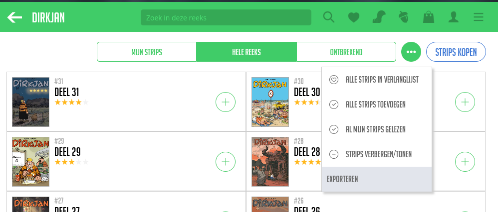

#Stripmunk Export

## About
Adds an export button to [the series page on stripmunk](https://app.stripmunk.be/series) which lets you export all entries in a series to csv. This
csv uses `;` delimiter which is compatible with Excel.

## Compatibility
Runs in any browser that allows userscripts

## How to install
TODO: link to greasyfork

## How to use
1. Go to [the series page on stripmunk](https://app.stripmunk.be/series) 
2. Pick a series you want to export
3. Click the 3 dots
4. Click "exporteren"

